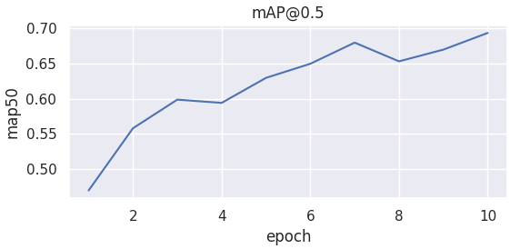
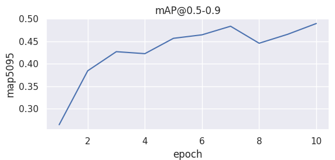

# Faster R-CNN Object Detection Application
- An end-to-end object detection system for detecting brain tumors in MRI images using Faster R-CNN with ResNet-50 backbone.
- The system allows users to upload images via a web interface and receive detected objects with bounding boxes in real time.
- As of January 7, 2026, the application is a web-based object detection system built using PyTorch, FastAPI, and React.

## Results
The following results demonstrate the performance of the Faster R-CNN model on validation MRI images after 10 training epochs.
- mAP@0.5: **0.69**

- mAP@0.5-0.9: **0.49**


## Problem Statement
- Brain tumor detection in MRI images is a critical task in medical imaging.
- Manual annotation is time-consuming and prone to human error.
- This project aims to automatically detect tumor regions using deep learning–based object detection.

## Architecture
```
Browser (Frontend)
    |
    | HTTP (Image Upload)
    v
Backend API (FastAPI)
    |
    | Load Model & Run Inference
    v
Faster R-CNN (PyTorch)
    |
    v
Detection Results (Annotated Image)
```

## Dataset
- Source: Kaggle – Brain-tumor dataset by Ultralytics
- Documentation: https://docs.ultralytics.com/datasets/detect/brain-tumor/
- Total images: 1116
  - Train: 893
  - Test: 223
- Dataset configuration: brain-tumor.yaml
- Classes: Brain tumor
- Annotation format: YOLO

## Methodology
1. Data preprocessing
2. Train Faster R-CNN with ResNet-50
3. Loss optimization (classification + bounding box regression)
4. Evaluation using Precision, Recall, mAP
5. Deployment-ready inference accessible via localhost web interface

## Model & Training
- Framework: PyTorch (Torch and TorchVision)
- Backbone: ResNet-50
- Optimizer: SGD
- Learning rate: 0.005
- Epochs: 10
- Hardware: NVIDIA GPU T4

## Project Structure
```
├── backend/                # FastAPI
│   └── main.py
├── checkpoints/
│   └── model.pth
├── data/
│   └── raw/
├── frontend/               # React / HTML / CSS
│   ├── src/
│   │   ├── App.css
│   │   ├── App.tsx
│   │   ├── index.css
│   │   └── main.tsx
│   ├── .gitignore
│   ├── index.html
│   ├── package.json
│   └── vite.config.ts
├── models/
│   ├── faster_rcnn_scratch.ipynb
│   └── train.ipynb
├── .gitignore
├── README.md
└── requirements.txt
```

## Installation
### 1. Clone this repo
```bash
git clone https://github.com/NguyenHuuPhat2203/Web-Based-Faster-R-CNN-Object-Detection-System.git
cd Web-Based-Faster-R-CNN-Object-Detection-System
python -m venv .venv
source .venv/bin/activate  # On Windows use `.venv\Scripts\activate`
pip install -r requirements.txt
```

### 2. Training (Deep Learning)
- Open `models/train.ipynb` in Jupyter or VS Code or google colab (preferred).
- Run cells to train the model and save the checkpoint to `checkpoints/model.pth` or manually download from google colab or google drive.

### 3. Backend (FastAPI)
- Run the server:
```bash
cd backend
uvicorn main:app --reload
```
- The API will be available at `http://localhost:8000`.

### 4. Frontend (React)
- Install dependencies:
```bash
cd frontend
npm install
```
- Run development server:
```bash
npm run dev
```
- Open the provided URL:`http://localhost:8001`.

## Future Works
- Try YOLO models for faster inference
- Deploy the model as a portable application
- Real-time detection using webcam

## Author(s)
Nguyen Huu Phat
Email: phat.nguyenluxefats@gmail.com  
GitHub: https://github.com/NguyenHuuPhat2203
